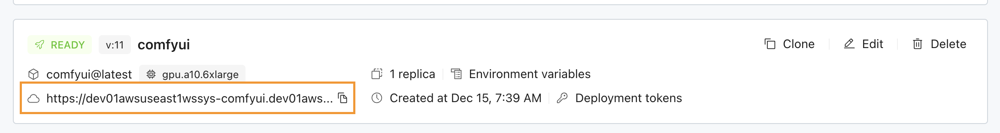
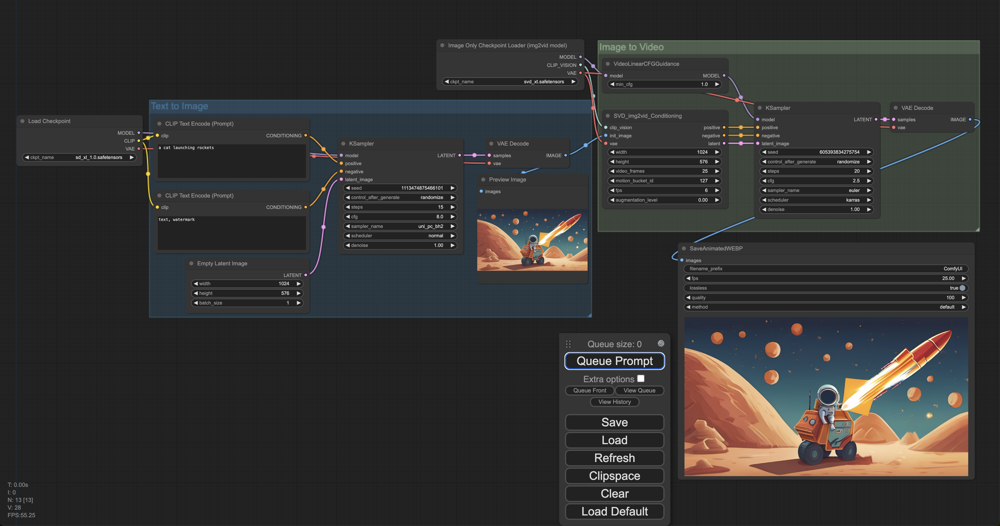

# ComfyUI

[ComfyUI](https://github.com/comfyanonymous/ComfyUI.git) is a powerful and modular stable diffusion GUI and backend that let you design and execute advanced stable diffusion pipelines using a graph/nodes/flowchart based interface.

## Install Lepton sdk
```shell
pip install leptonai
```

## Launch Stable Diffusion web UI in the cloud

Similar to other examples, you can run ComfyUI on Lepton Cloud Platform easily, e.g.:

```shell
lep photon create -n comfyui -m photon.py
lep photon push -n comfyui
lep photon run \
    -n comfyui \
    --resource-shape gpu.a10
    --public
```

You can visit [dashboard.lepton.ai](https://dashboard.lepton.ai/) to use the web Dashboard, or use `lep` cli to manage the launched deployment:
```shell
lep deployment status -n comfyui
```

## Client

Once the ComfyUI server is up, you can copy the deployment url shown on the Lepton Dashboard (or in the `lep` cli output)



and visit it in the web browser. e.g. running the sdxl + svd models to do text to video:


