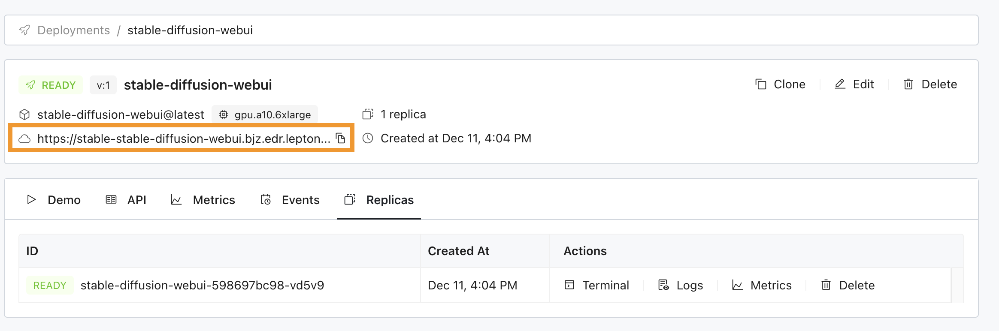

# Stable Diffusion web UI

[Stable Diffusion web UI](https://github.com/AUTOMATIC1111/stable-diffusion-webui.git) is a browser interface based on Gradio library for Stable Diffusion.

## Install Lepton sdk
```shell
pip install leptonai
```

## Launch Stable Diffusion web UI in the cloud

Similar to other examples, you can run Stable Diffusion web UI on Lepton Cloud Platform easily, e.g.:

```shell
lep photon create -n stable-diffusion-webui -m photon.py
lep photon push -n stable-diffusion-webui
lep photon run \
    -n stable-diffusion-webui \
    --resource-shape gpu.a10
    --public
```

You can visit [dashboard.lepton.ai](https://dashboard.lepton.ai/) to use the web Dashboard, or use `lep` cli to manage the launched deployment:
```shell
lep deployment status -n stable-diffusion-webui
```

## Client

Once the Stable Diffusion web UI server is up, you can copy the deployment url shown on the Lepton Dashboard (or in the `lep` cli output)



and visit it in the web browser


