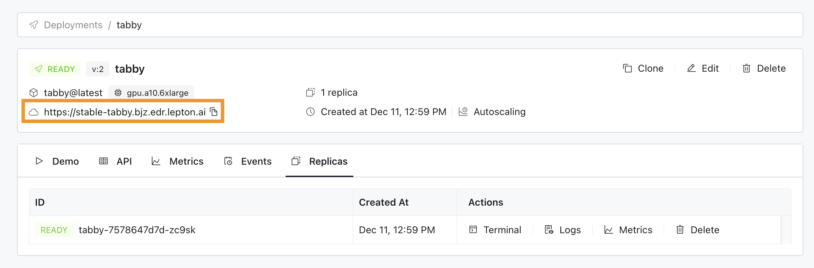
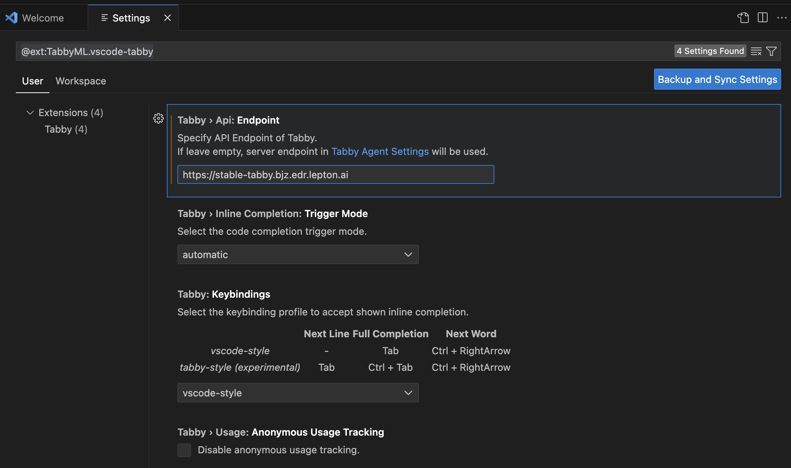
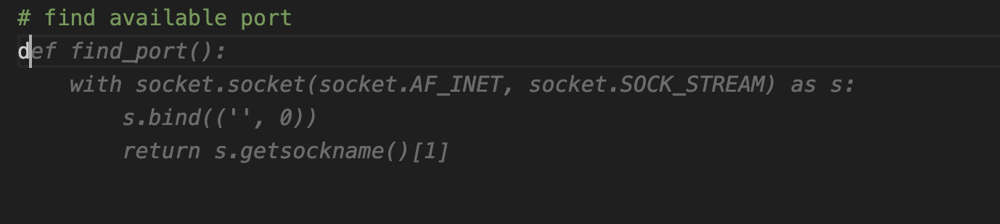

# Tabby

[Tabby](https://github.com/TabbyML/tabby) is an AI coding assistant, offering an open-source and on-premises alternative to GitHub Copilot.

## Install Lepton sdk
```shell
pip install leptonai
```

## Launch Tabby in the cloud

Similar to other examples, you can run Tabby on Lepton Cloud Platform easily, e.g.:

```shell
lep photon create -n tabby -m photon.py
lep photon push -n tabby
lep photon run \
    -n tabby \
    --resource-shape gpu.a10
    --public
```

You can visit [dashboard.lepton.ai](https://dashboard.lepton.ai/) to use the web Dashboard, or use `lep` cli to manage the launched deployment:
```shell
lep deployment status -n tabby
```

You can configure the underlying model (default `TabbyML/StarCoder-1B`) with the `MODEL` environment variable, e.g. to switch to use `TabbyML/DeepseekCoder-1.3B`:

```shell
lep photon run \
    -n tabby- \
    -e TabbyML/DeepseekCoder-1.3B
    --resource-shape gpu.a10
    --public
```

## Client

Once the Tabby server is up, you can use the deployment url shown on the Lepton Dashboard (or in the `lep` cli output)



as API Endpoint of Tabby, to configure the supported [IDE extensions](https://tabby.tabbyml.com/docs/extensions). e.g. In VSCode:



and start coding with the power of AI!


