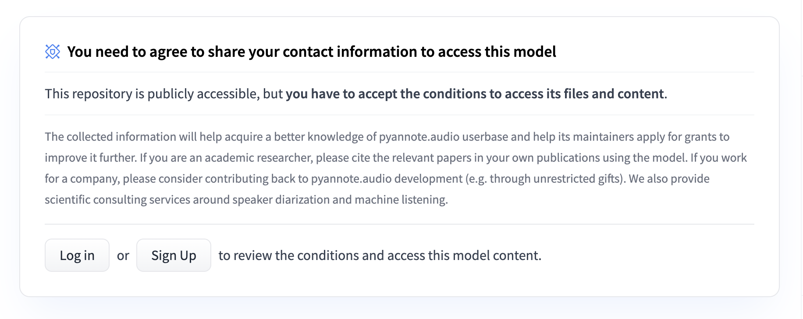

# WhisperX

This example demonstrates how to run the WhisperX model on Lepton. [WhisperX](https://github.com/m-bain/whisperX) is similar to the whisper example, but does transcription, alignment, and diarization for the input.

The following example shows the WhisperX demo that allows one to very quickly recognize short audios. For long audios like podcasts, instead of having a long-waiting api, it is easier to build a service that does the actual recognition as a background task - see the notebook [What does a great podcast sound like?](audio_analysis.ipynb) as an end to end example.

## Note on custom environment

Similar to the Whisper JAX example, if you are running locally, we recommend you to use a custom environment like `conda` or `virtualenv`.

Usually, when you run different AI models, they require specific dependencies that sometimes conflict with each other. This is particularly true in the whisper case - from `requirements.txt`, you may notice that there are quite a bit of specific version requirements.

This is where having a separate service like Lepton becomes super useful: we can create a python environment (using e.g. conda or virtualenv), installed the required dependencies, run the photon as a web service, and then in the regular python environment, simply call the web service as if we were using a regular python function. Comparing to some apparent choices:

- unlike a single python environment, we don't need to resolve version conflicts of different algorithms;

## Prerequisite

Note that one of the dependency relies on 3 Hugging Face Hub models that would require you to sign some terms of usage beforehand. Otherwise it will throw error. Simply proceed to the website for [Segmentation](https://huggingface.co/pyannote/segmentation) , [Voice Activity Detection (VAD)](https://huggingface.co/pyannote/voice-activity-detection) , and [Speaker Diarization](https://huggingface.co/pyannote/speaker-diarization) and sign the terms.



You would also need a Hugging Face Access Token at hand. Simply following the steps in the [official guide](https://huggingface.co/docs/hub/security-tokens).

## Running with a custom environment

We recommend you use conda or virtualenv to start a whisper-specific environment. For example, if you use conda, it's easy to do:

```shell
# pick a python version of your favorite
conda create -n whisperx python=3.10
conda activate whisperx
```

After that, install lepton [per the installation instruction](https://www.lepton.ai/docs/overview/quickstart#1-installation), and install the required dependencies of this demo via:

```shell
pip install -r requirements.txt
```

After this, you can launch whisperx like:

```shell
# Set your huggingface token. This is required to obtain the respective models.
export HUGGING_FACE_HUB_TOKEN="replace-with-your-own-token"
python main.py
```

It will download the paramaters and start the server. After that, use the regular python client to access the model:

```python
from leptonai.client import Client, local
c = Client(local())
```

and invoke transcription or translation as follows:

```python
>> c.run(input=FileParam(open("assets/thequickbrownfox.mp3", "rb")))
[{'start': 0.028,
  'end': 2.06,
  'text': ' A quick brown fox jumps over the lazy dog.',
  'words': [{'word': 'A', 'start': 0.028, 'end': 0.068, 'score': 0.5},
   {'word': 'quick', 'start': 0.109, 'end': 0.31, 'score': 0.995},
   {'word': 'brown',
    'start': 0.35,
    'end': 0.571,
    'score': 0.849,
    'speaker': 'SPEAKER_00'},
   {'word': 'fox',
    'start': 0.612,
    'end': 0.853,
    'score': 0.897,
    'speaker': 'SPEAKER_00'},
   {'word': 'jumps',
    'start': 0.893,
    'end': 1.175,
    'score': 0.867,
    'speaker': 'SPEAKER_00'},
   {'word': 'over',
    'start': 1.255,
    'end': 1.416,
    'score': 0.648,
    'speaker': 'SPEAKER_00'},
   {'word': 'the',
    'start': 1.456,
    'end': 1.517,
    'score': 0.998,
    'speaker': 'SPEAKER_00'},
   {'word': 'lazy',
    'start': 1.557,
    'end': 1.839,
    'score': 0.922,
    'speaker': 'SPEAKER_00'},
   {'word': 'dog.',
    'start': 1.859,
    'end': 2.06,
    'score': 0.998,
    'speaker': 'SPEAKER_00'}],
  'speaker': 'SPEAKER_00'}]
```

## Running with Lepton

The above example runs on the local machine. If your machine does not have a public facing IP, or more commonly, you want a stable server environment to host your model - then running on the Lepton cloud platform is the best option. To run it on Lepton, you can simply create a photon and push it to the cloud.

To have HuggingFace Hub API access function properly, we would also need it set as an available environment variable in the cloud. To do so, simply run the following command to store it as a [secret](https://www.lepton.ai/docs/advanced/env_n_secrets):

```shell
lep secret create -n HUGGING_FACE_HUB_TOKEN -v VALUE_OF_YOUR_TOKEN
```

You can run the following command to confirm that the secret is stored properly:

```shell
lep secret list
```

which should return something like below

```txt
               Secrets
┏━━━━━━━━━━━━━━━━━━━━━━━━┳━━━━━━━━━━┓
┃ ID                     ┃ Value    ┃
┡━━━━━━━━━━━━━━━━━━━━━━━━╇━━━━━━━━━━┩
│ HUGGING_FACE_HUB_TOKEN │ (hidden) │
└────────────────────────┴──────────┘
```

Now you can proceed to photo creation and deployment by running the following command:

```shell
lep login
lep photon create -n whisperx -m main.py
lep photon push -n whisperx
# An A10 machine is usually big enough to run the large-v2 model.
# note you need to specify the secret that needs to be available in the run
lep photon run -n whisperx --resource-shape gpu.a10 --secret HUGGING_FACE_ACCESS_TOKEN
```

After that, you can use the `lep deployment status` to obtain the public address of the photon, and use the same slack app to connect to it:

```shell
>> lep deployment status -n whisperx
Created at: 2023-08-09 20:24:48
Created at: 2023-08-16 11:08:56
Photon ID:  whisperx-bsip0d8q
State:      Running
Endpoint:   https://latest-whisperx.cloud.lepton.ai
Is Public:  No
Replicas List:
┏━━━━━━━━━━━━━━━━━━━━━━━━━━━┳━━━━━━━━┳━━━━━━━━━┓
┃ replica id                ┃ status ┃ message ┃
┡━━━━━━━━━━━━━━━━━━━━━━━━━━━╇━━━━━━━━╇━━━━━━━━━┩
│ whisperx-5ddc79f555-l59cj │ Ready  │ (empty) │
└───────────────────────────┴────────┴─────────┘
1 out of 1 replicas ready.
```

To access the model, we can create a client similar to the local case, simply replace `local()` with the workspace, deployment name, and token. Also, since we are running remote now, we will need to upload the audio files. This is done by calling the `run_updload` path:

```python
>> from leptonai.client import Client
>> from leptonai.photon import FileParam
>> c = Client("YOUR_WORKSPACE_NAME", "whisperx", token="YOUR_TOKEN")
>> c.run(input=FileParam(open("assets/thequickbrownfox.mp3", "rb")))
[{'start': 0.028,
  'end': 2.06,
  'text': ' A quick brown fox jumps over the lazy dog.',
  'words': [{'word': 'A', 'start': 0.028, 'end': 0.068, 'score': 0.5},
   {'word': 'quick', 'start': 0.109, 'end': 0.31, 'score': 0.995},
   {'word': 'brown',
    'start': 0.35,
    'end': 0.571,
    'score': 0.849,
    'speaker': 'SPEAKER_00'},
   {'word': 'fox',
    'start': 0.612,
    'end': 0.853,
    'score': 0.897,
    'speaker': 'SPEAKER_00'},
   {'word': 'jumps',
    'start': 0.893,
    'end': 1.175,
    'score': 0.867,
    'speaker': 'SPEAKER_00'},
   {'word': 'over',
    'start': 1.255,
    'end': 1.416,
    'score': 0.648,
    'speaker': 'SPEAKER_00'},
   {'word': 'the',
    'start': 1.456,
    'end': 1.517,
    'score': 0.998,
    'speaker': 'SPEAKER_00'},
   {'word': 'lazy',
    'start': 1.557,
    'end': 1.839,
    'score': 0.922,
    'speaker': 'SPEAKER_00'},
   {'word': 'dog.',
    'start': 1.859,
    'end': 2.06,
    'score': 0.998,
    'speaker': 'SPEAKER_00'}],
  'speaker': 'SPEAKER_00'}]
```

Unlike local deployment, running on the Lepton cloud platform comes with a series of advantages, especially in the whisperx case:

- You do not need to worry about reproducible software environment. The photon is guaranteed to run on the same environment as you created it.
- Scaling is easier - you can simply increase the number of replicas if you need more capacity.
- Automatic fault tolerance - if the photon crashes, it will be automatically restarted.

Happy building!
